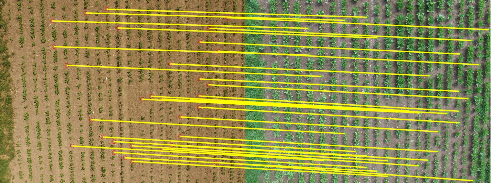

# Similarity Invariant Geometry Feature

In this project, we implement a geometric feature descriptor using point
patterns aimed at matching images which have large visual differences.
The descriptor is invariant upto similarity transform, i.e. it can recover
translation, rotation and scale parameters for points lying on a plane.

## Example programs

* ex_sigf_matching_full.m : 
Matches two images of crop fields.

* ex_sigf_matching_stages.m :
Matches two images of crop fields given the interest points (ex. gaps) are precomputed.

* ex_detect_gaps.m :
Computes gaps points in the field image.